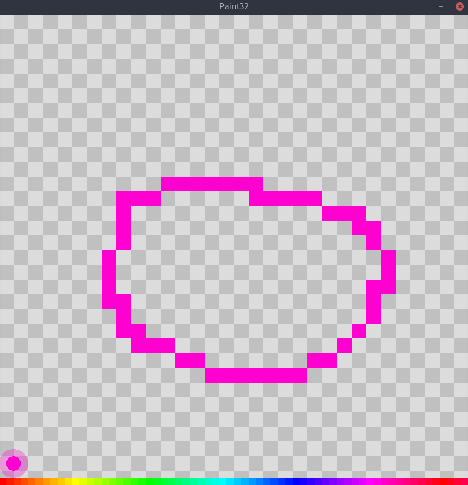
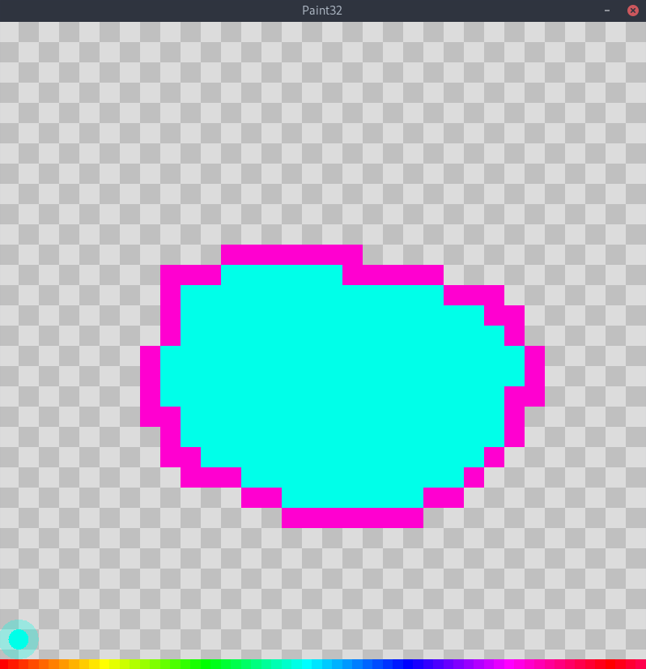
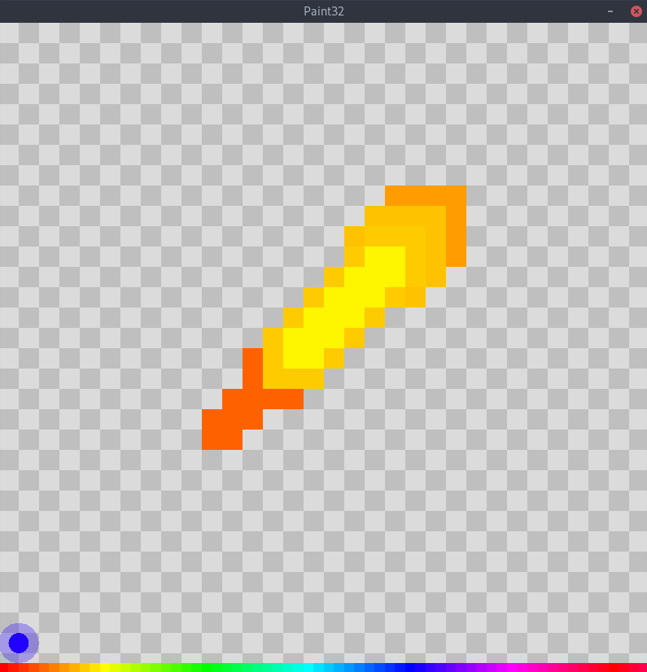

# Paint32
Simple paint application.

- [Paint32](#paint32)
- [Getting Started](#getting-started)
- [Usage](#usage)
	- [Hotkeys](#hotkeys)
	- [Screenshots](#screenshots)
	- [Documentation:](#documentation)
- [Credits](#credits)
	- [Dependancies:](#dependancies)
	- [Libraries & Sources:](#libraries--sources)
	- [Authors](#authors)
	- [License](#license)

# Getting Started
1. **Install all [dependacies](#dependancies) & [libraries](#libraries--sources).**
2. Clone or download this repository.
3. Run make to compile & run the program.
4. Compile the program.
	
	```make``` - Compile program & link all libraries.

4. Run The Program with

	```make run``` - Run the program.

# Usage

**Changing Colors** - There are two ways to change colors.
1. You can use the scroll wheel.
2. Press the x key while, slding the mouse on the x axis.


## Hotkeys

|Key|Action
|---|---
|Left Mouse|Draw
|Right Mouse|Erase
|Scroll Wheel|Modify Color
|x|Activate color slider
|c|Clear canvas
|v|Pixel draw tool
|b|Bucket tool

## Screenshots

**Bucket Fill Tool**




**Pixel Tool**



## Documentation:

`TODO`

# Credits

## Dependancies:
- Make

## Libraries & Sources:
- OpenGL
- FreeGLUT
- GLU (OpenGL Utility Librarry)

## Authors
Ya boy [Elias Mawa](https://github.com/CeruleanSong)

## License
Under [GPL-3.0 Liecence](/LICENSE)
